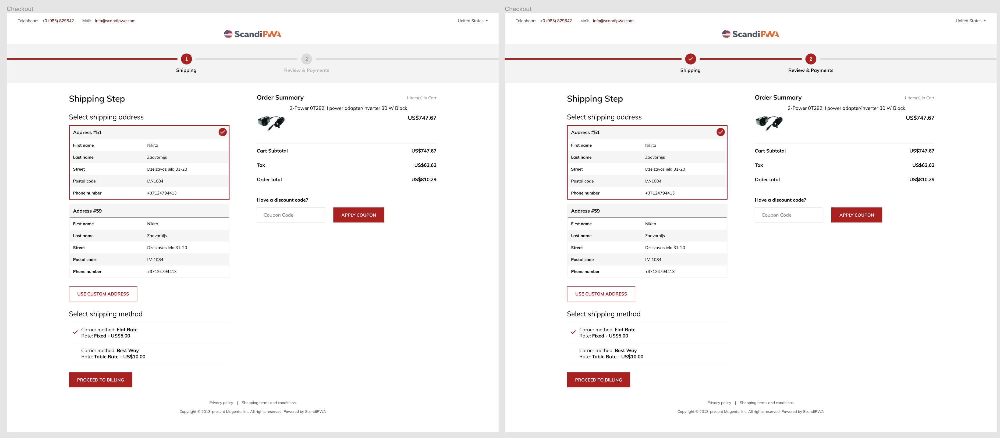

### Version of README [Portuguese](./README.md)

# PWA-CheckoutStep-Challenge

## Challenge Requisites

    

1. Progressbar must match the website primary color  
2. The last step checkpoint doesn't render, you fill the progressbar to the end instead. So when you have shipping, billing and success steps, you render two checkpoints for shipping and billing, but on the last (third) step you fill the progressbar to the end so it becomes completed  
3. Components should be reusable. No hardcode is allowed, all data is provided in the app. It should support any amount of steps. It should be possible to take this component out and put it to any other ScandiPWA project without any modifications  
4. When you complete a step, the progressbar should fill the next segment with animation  

## Challenge Results

1- My customizaion is located at `src` folder like any PWA aplication.

<!--  -->

## Installation

yarn create scandipwa-app `my-app`  
***Enter to the project directory***  
cd `my-app`  
***Downgrade ScandiPWA***  
yarn add @scandipwa/scandipwa@4.5.1  
copy `composer.json` content from this repository to your own  
***config***  
open `package.json`, find the `proxy` field and paste **<https://demo100-ors-1588667385-swpwa451-zco.scandipwa.cloud/>**  
use `yarn` or `npm i` command.

This package contains new ScandiPWA theme sources. Your parent theme is `@scandipwa/scandipwa`.

## Available Scripts

`npm run start` or `yarn start`
**Starts the development server.**

`npm run build` or `yarn build`
**Bundles the app into static files for production.**
