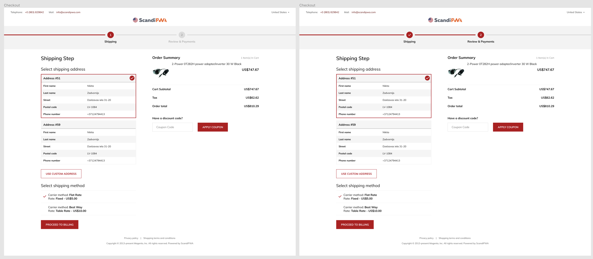

### Version of README [English](./README-en.md)

# PWA-CheckoutStep-Desafio

## Requisitos do Desafio

    

1. A barra de progresso deve corresponder à cor primária do site  
2. O último checkpoint não é renderizado, você preenche a barra de progresso até o final. Quando você tem etapas de envio, cobrança e sucesso, você renderiza dois pontos de verificação para envio e cobrança, mas na última (terceira) etapa você preenche a barra de progresso até o final para que ela seja concluída  
3. Os componentes devem ser reutilizáveis. Todos os dados são fornecidos no aplicativo. Ele deve suportar qualquer quantidade de etapas. Deve ser possível retirar este componente e colocá-lo em qualquer outro projeto sem modificação  
4. Ao concluir uma etapa, a barra de progresso deve preencher o próximo segmento com animação  

## Resultados do Desafio

1- Minha customização está localizada na pasta `src` como qualquer aplicativo PWA.

<!--  -->

## Instalação

yarn create scandipwa-app `my-app`  
***Enter to the project directory***  
cd `my-app`  
***Downgrade ScandiPWA***  
yarn add @scandipwa/scandipwa@4.5.1  
copy `composer.json` content from this repository to your own  
***config***  
open `package.json`, find the `proxy` field and paste **<https://demo100-ors-1588667385-swpwa451-zco.scandipwa.cloud/>**  
use `yarn` or `npm i` command.

This package contains new ScandiPWA theme sources. Your parent theme is `@scandipwa/scandipwa`.

## Available Scripts

`npm run start` or `yarn start`
**Starts the development server.**

`npm run build` or `yarn build`
**Bundles the app into static files for production.**
